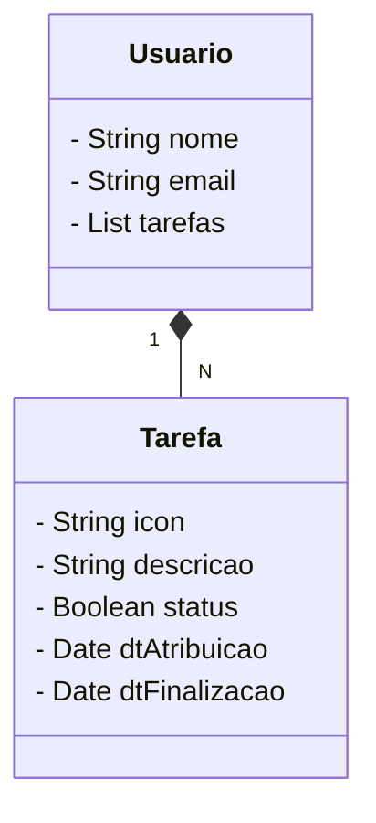

# 📌 Desafio Final - Santander Dev Week 2023

Este projeto foi desenvolvido como desafio final da **Santander Dev Week 2023**, com o objetivo de aplicar os conhecimentos adquiridos durante o evento.

A proposta é criar uma **API RESTful** utilizando **Java com Spring Boot**, simulando um sistema de **gerenciamento de tarefas** para usuários.

---

## 🚀 Tecnologias Utilizadas

- ✅ Java 17
- ✅ Spring Boot 3.1.4
- ✅ Spring Data JPA
- ✅ Spring Web
- ✅ PostgreSQL Driver
- ✅ H2 Database (ambiente de desenvolvimento/testes)
- ✅ Swagger/OpenAPI - `springdoc-openapi-starter-webmvc-ui`
- ✅ Git, GitHub e SSH

---

## 🧩 Diagrama de Classes

Sistema com entidades `Usuario` e `Tarefa`, onde um usuário pode ter várias tarefas associadas.



---

## 🌐 Documentação da API

Acesse a interface interativa do Swagger para testar e explorar os endpoints:

🔗 [http://localhost:8080/swagger-ui/index.html](http://localhost:8080/swagger-ui/index.html)

---

## 🔧 Endpoints da API

### 📄 Tarefas

| Método | Endpoint                  | Descrição                |
|--------|---------------------------|--------------------------|
| GET    | `/tarefas`                | Listar todas as tarefas  |
| GET    | `/tarefas/{id}`           | Buscar tarefa por ID     |
| POST   | `/tarefas`                | Criar nova tarefa        |

#### 🔹 Exemplo de Body - POST `/tarefas`

```json
{
  "descricao": "Criar diagramas",
  "status": true,
  "dtAtribuicao": "2023-10-21T04:13:36.217Z",
  "dtFinalizacao": "2023-10-21T04:13:36.217Z"
}
```

---

### 👤 Usuários

| Método | Endpoint                  | Descrição                |
|--------|---------------------------|--------------------------|
| GET    | `/usuarios`               | Listar todos os usuários |
| GET    | `/usuarios/{id}`          | Buscar usuário por ID    |
| POST   | `/usuarios`               | Criar novo usuário       |

#### 🔹 Exemplo de Body - POST `/usuarios`

```json
{
  "nome": "Maria da Silva",
  "email": "maria@email.com",
  "tarefas": [
    {
      "descricao": "Estudar Spring",
      "status": true,
      "dtAtribuicao": "2023-10-21T04:21:05.083Z",
      "dtFinalizacao": "2023-10-21T04:21:05.083Z"
    }
  ]
}
```

---

## 📦 Resposta de Exemplo - GET `/tarefas`

```json
[
  {
    "id": 1,
    "descricao": "Revisar código",
    "status": true,
    "dtAtribuicao": "2023-10-21T04:05:06.868Z",
    "dtFinalizacao": "2023-10-21T04:10:06.868Z"
  },
  {
    "id": 2,
    "descricao": "Documentar projeto",
    "status": false,
    "dtAtribuicao": "2023-10-21T04:11:06.868Z",
    "dtFinalizacao": null
  }
]
```

---

## ▶️ Como Executar o Projeto

1. Clone o repositório:

```bash
git clone https://github.com/robsonosbor/Desafio-Santander-Dev-Week-Final.git
```

2. Acesse a pasta do projeto:

```bash
cd Desafio-Santander-Dev-Week-Final
```

3. Execute o projeto com Maven:

```bash
./mvnw spring-boot:run
```

4. Acesse o navegador em:

```
http://localhost:8080
```

---

## 📬 Contato

Desenvolvido por **Robson Osbor**.

- 💼 [LinkedIn](https://www.linkedin.com/in/robsonbatista1975/) <!-- Substitua pelo seu perfil -->
- ✉️ Email: [E-mail](mailto:email@email.com) <!-- Substitua pelo seu email -->

---

## 📄 Licença

Este projeto está licenciado sob a Licença MIT. Consulte o arquivo [LICENSE](./LICENSE) para mais informações.

---